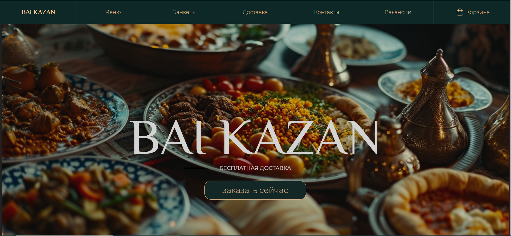

# Сайт ресторана "BAI KAZAN "
## Описание:
Это сайт ресторана восточной кухни. Проект представляет собой frontend для сайта ресторна. Для хранения объектов использовался интсрумент Vuex. Проект состоит из множества независимых компонентов, а с помощью Vue router комоненты объединяются в страницу. Для деплоинга проекта в gitHub Actions был написан CI/CD pipeline. Веб сайт доступен по ссылке https://chubak-s.github.io/Restaurant.
## Функционал:
Реализованы:
+ Меню, с возможносью добавить блюдо в корзину;
+ Удаление товара из корзины;
+ Оформление заказа;
+ Лендинг;
## Технологии: 
* Vue.js 3
* HTML5
* CSS
* JavaScipt
## Скриншоты с сайта:
